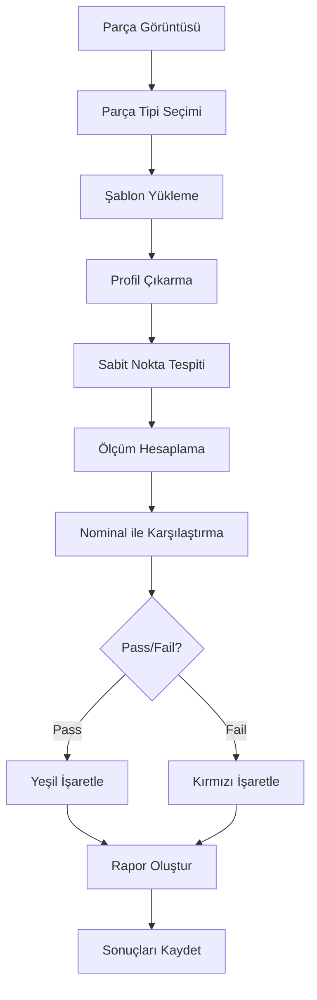

# Sabit Ölçüm Noktaları ve Otomatik Tespit Sistemi - Detaylı Plan

**Tarih:** 12 Mart 2026  
**Proje:** CNC Parça Ölçüm Sistemi - Fabrika Kurulumu  
**Durum:** Planlama Aşaması

---

## 📋 GEREKSİNİM ANALİZİ

### Mevcut Sorun
- Sistem "kafasına göre" ölçüm noktaları tespit ediyor
- Her parçada farklı noktalarda ölçüm yapıyor
- Fabrika için sabit, tekrarlanabilir ölçümler gerekiyor

### İstenen Çözüm
- **Sabit ölçüm noktaları:** Teknik çizimdeki gibi (03, 04, 05, 06, 08, 17, 18, 21, 22, 24)
- **Nominal değerler:** Tablodaki değerler (Ø14.6550, 22.9150, vb.)
- **Toleranslar:** Tablodaki LOWER_TOL ve UPPER_TOL değerleri
- **Otomatik Pass/Fail:** Ölçüm sonuçlarının toleranslarla karşılaştırılması

---

## 🎯 ÖLÇÜM NOKTALARI REFERANSI

### Teknik Çizimden Çıkarılan Noktalar

| Kod | Tip | Açıklama | Ölçüm Türü | Yön |
|-----|-----|----------|------------|-----|
| **03** | ⌀ | Sol bölüm çapı | Çap (Diameter) | Y-ekseni |
| **04** | ⌀ | Orta bölüm 1 çapı | Çap (Diameter) | Y-ekseni |
| **05** | ⌀ | Orta bölüm 2 çapı | Çap (Diameter) | Y-ekseni |
| **06** | ⌀ | Orta bölüm 3 çapı | Çap (Diameter) | Y-ekseni |
| **08** | ⌀ | Sağ ana bölüm çapı | Çap (Diameter) | Y-ekseni |
| **17** | H | Üst çıkıntı yüksekliği | Yükseklik (Height) | Y-ekseni |
| **18** | H/⌀ | Geçiş bölümü | Çap veya Yükseklik | Y-ekseni |
| **21** | ═ | Toplam uzunluk | Uzunluk (Length) | X-ekseni |
| **22** | ═ | Bölüm uzunluğu 1 | Uzunluk (Length) | X-ekseni |
| **24** | ═ | Bölüm uzunluğu 2 | Uzunluk (Length) | X-ekseni |

**Not:** 36 iptal, yerine 37 kullanılıyor (tabloda görüldüğü gibi)

---

## 📊 TABLO VERİLERİ (Nominal Değerler)

| Kod | Nominal (mm) | LOWER_TOL | UPPER_TOL | Min (mm) | Max (mm) |
|-----|--------------|-----------|-----------|----------|----------|
| 03 | 14.6550 | -0.0150 | +0.0150 | 14.6400 | 14.6700 |
| 04 | 22.9150 | -0.0130 | +0.0200 | 22.9020 | 22.9350 |
| 05 | 25.0700 | -0.0200 | +0.0200 | 25.0500 | 25.0900 |
| 06 | 25.0700 | -0.0200 | +0.0200 | 25.0500 | 25.0900 |
| 08 | 29.7000 | -0.1000 | +0.1000 | 29.6000 | 29.8000 |
| 17 | 4.0000 | -0.1000 | +0.1000 | 3.9000 | 4.1000 |
| 18 | 12.9000 | -0.1000 | +0.1000 | 12.8000 | 13.0000 |
| 21 | 30.0000 | -0.2000 | +0.2000 | 29.8000 | 30.2000 |
| 22 | 18.9000 | -0.1000 | +0.1000 | 18.8000 | 19.0000 |
| 24 | 14.0000 | -0.1000 | +0.1000 | 13.9000 | 14.1000 |

---

## 🏗️ SİSTEM MİMARİSİ

### 1. Parça Profili Şablonu (Template)

```
┌─────────────────────────────────────────────────────────────┐
│                    PARÇA PROFİL ŞABLONU                      │
├─────────────────────────────────────────────────────────────┤
│  Parça Tipi: [ORNEK_PARCA_TIPI]                             │
│                                                              │
│  Y-Ölçümleri (Çaplar - X konumları sabit):                  │
│  ├── 03: X = 50px (sol bölüm ortası)                        │
│  ├── 04: X = 150px (orta bölüm 1)                           │
│  ├── 05: X = 250px (orta bölüm 2)                           │
│  ├── 06: X = 350px (orta bölüm 3)                           │
│  ├── 08: X = 550px (sağ ana bölüm)                          │
│  ├── 17: X = 100px (üst çıkıntı)                            │
│  └── 18: X = 200px (geçiş bölümü)                           │
│                                                              │
│  X-Ölçümleri (Uzunluklar - Y konumları sabit):              │
│  ├── 21: Y = top_edge + 10px (toplam uzunluk)               │
│  ├── 22: Y = section_2_center (bölüm 1-2 arası)             │
│  └── 24: Y = section_3_center (bölüm 2-3 arası)             │
└─────────────────────────────────────────────────────────────┘
```

### 2. Ölçüm Noktası Tespit Stratejisi

#### A. Çap Ölçümleri (Y-ekseni)
```
Strateji: X koordinatları sabit, parça profilinden Y'de ortalama çap al

1. Şablondaki X konumuna git
2. O X'deki çap profilini oku (top_edge, bottom_edge)
3. Çap = (bottom_y - top_y) * Y_kalibrasyon
4. Nominal değerle karşılaştır
5. Pass/Fail belirle
```

#### B. Uzunluk Ölçümleri (X-ekseni)
```
Strateji: Bölüm geçişlerinden uzunlukları hesapla

1. Bölüm tespiti yap (detect_sections)
2. Her bölümün X başlangıç/bitişini bul
3. Uzunluk = (x_end - x_start) * X_kalibrasyon
4. Nominal değerle karşılaştır
5. Pass/Fail belirle
```

#### C. Yükseklik Ölçümleri (H)
```
Strateji: Belirli X'deki üst/alt kenar farkı

1. Şablondaki X konumuna git
2. Üst kenar Y koordinatını bul
3. Referans çizgiden farkı hesapla
4. Nominal değerle karşılaştır
```

---

## 🔧 IMPLEMENTASYON PLANI

### Faz 1: Veri Modeli (JSON Şema)

```json
{
  "part_template": {
    "template_id": "ORNEK_PARCA_TIPI",
    "description": "Örnek CNC Parçası",
    "measurement_points": [
      {
        "code": "03",
        "type": "diameter",
        "axis": "Y",
        "x_position_mm": 5.0,
        "nominal_mm": 14.6550,
        "lower_tol": -0.0150,
        "upper_tol": 0.0150,
        "description": "Sol bölüm çapı"
      },
      {
        "code": "21",
        "type": "length",
        "axis": "X",
        "y_reference": "top_edge",
        "nominal_mm": 30.0000,
        "lower_tol": -0.2000,
        "upper_tol": 0.2000,
        "description": "Toplam uzunluk"
      }
    ]
  }
}
```

### Faz 2: Backend Modülleri

#### A. `template_manager.py`
- Şablon CRUD işlemleri
- Şablon doğrulama
- Varsayılan şablonlar

#### B. `fixed_measurement_engine.py`
- Şablona göre ölçüm noktalarını tespit
- Nominal değerlerle karşılaştırma
- Pass/Fail hesaplama

#### C. API Endpoint'leri
```
POST   /api/templates              # Yeni şablon oluştur
GET    /api/templates              # Şablon listesi
GET    /api/templates/{id}         # Şablon detayı
PUT    /api/templates/{id}         # Şablon güncelle
DELETE /api/templates/{id}         # Şablon sil

POST   /api/measure/fixed          # Sabit noktalarda ölçüm
GET    /api/measure/results/{id}   # Ölçüm sonuçları
```

### Faz 3: Frontend Bileşenleri

#### A. Şablon Editörü
- Ölçüm noktası ekleme/çıkarma
- Nominal değer ve tolerans girişi
- Görsel konum belirleme

#### B. Ölçüm Tablosu
- Tablodaki gibi görünüm
- Pass/Fail renklendirme (yeşil/kırmızı)
- Sapma değerleri
- Otomatik doldurma

#### C. Raporlama
- Tablo formatında PDF/Excel
- Pass/Fail özetleri
- İstatistikler

---

## 📈 İŞ AKIŞI (Workflow)



---

## 🎯 BAŞARI KRİTERLERİ

1. **Tekrarlanabilirlik:** Aynı parça tipinde %100 aynı noktalarda ölçüm
2. **Doğruluk:** ±0.02mm tekrarlanabilirlik
3. **Hız:** < 2 saniye/parça
4. **Kullanılabilirlik:** Operatör sadece parça tipi seçecek

---

## ⚠️ RİSKLER VE ÇÖZÜMLER

| Risk | Olasılık | Etki | Çözüm |
|------|----------|------|-------|
| Parça pozisyon değişimi | Yüksek | Yüksek | Referans noktası tespiti |
| Aydınlatma değişimi | Orta | Orta | Otomatik threshold ayarı |
| Farklı parça boyutları | Yüksek | Orta | Ölçeklenebilir şablonlar |
| Kamera kayması | Düşük | Yüksek | Periyodik kalibrasyon |

---

## 📅 IMPLEMENTASYON SIRASI

1. **Template veri modeli** → JSON şema + validasyon
2. **Template Manager** → CRUD API'leri
3. **Fixed Measurement Engine** → Ölçüm mantığı
4. **Frontend Template Editor** → Şablon oluşturma UI
5. **Measurement Table** → Tablo görünümü
6. **Pass/Fail Logic** → Karşılaştırma ve renklendirme
7. **Reporting** → PDF/Excel raporları
8. **Integration & Test** → Sistem testi

---

**Sonraki Adım:** Bu planı onaylarsanız, implementasyona başlayacağım. Önce template veri modelini ve backend API'lerini oluşturacağım.
